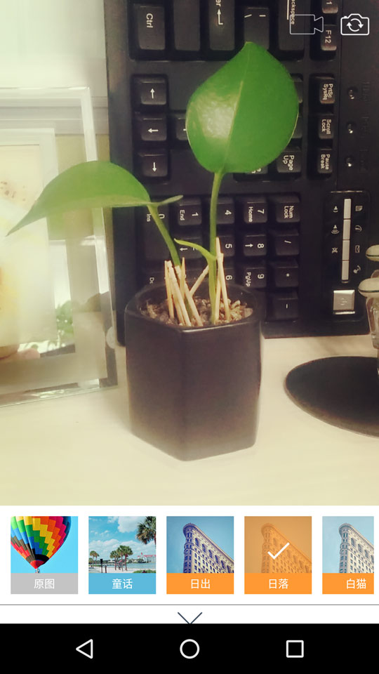
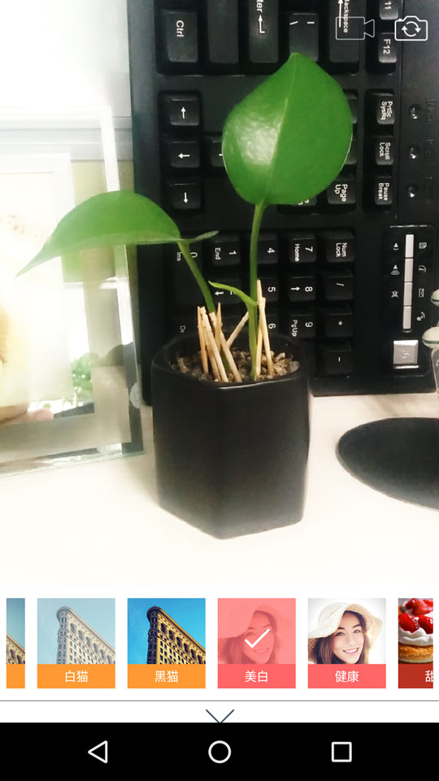
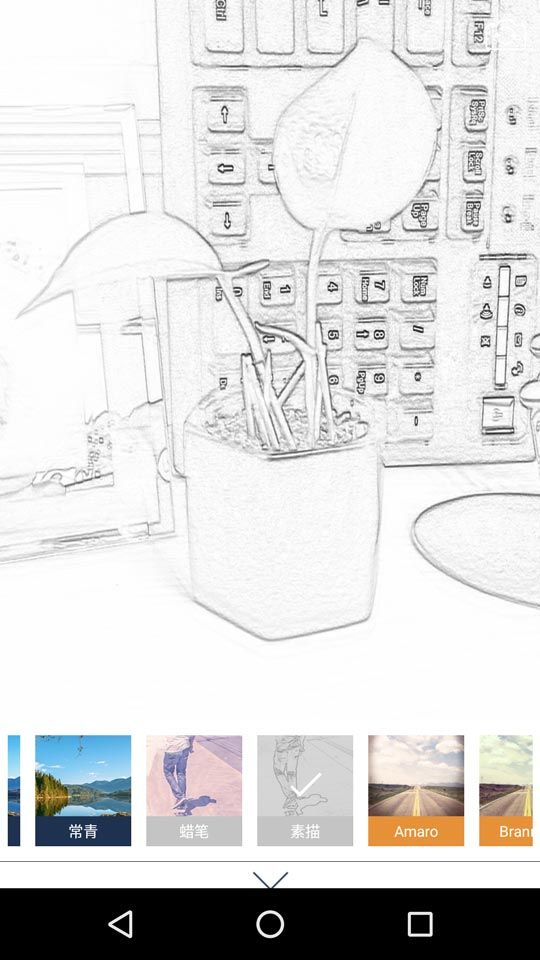

### MagicCamera

实时滤镜相机

[原地址点这里](https://github.com/wuhaoyu1990/MagicCamera)

种种迹象表明，作者已弃坑，由于需要做相关的开发，找到这个项目，时间太久远，项目已经不能运行在高版本的AS下了，将代码重新整理，方便大家。

Demo未做改动，magicfilter采用了cmake方式重新编译。

**再次感谢[作者](https://github.com/wuhaoyu1990)，谢谢！**

#### 样张：

